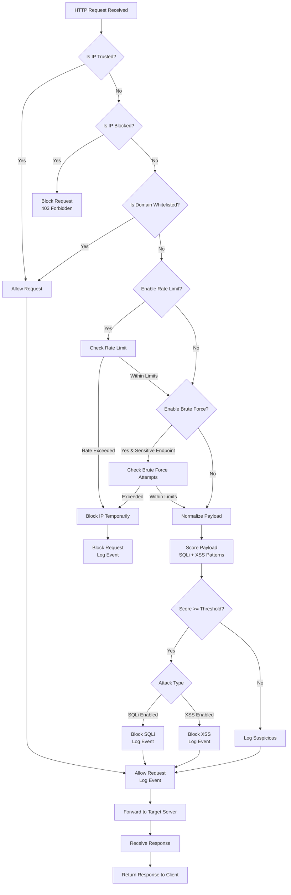
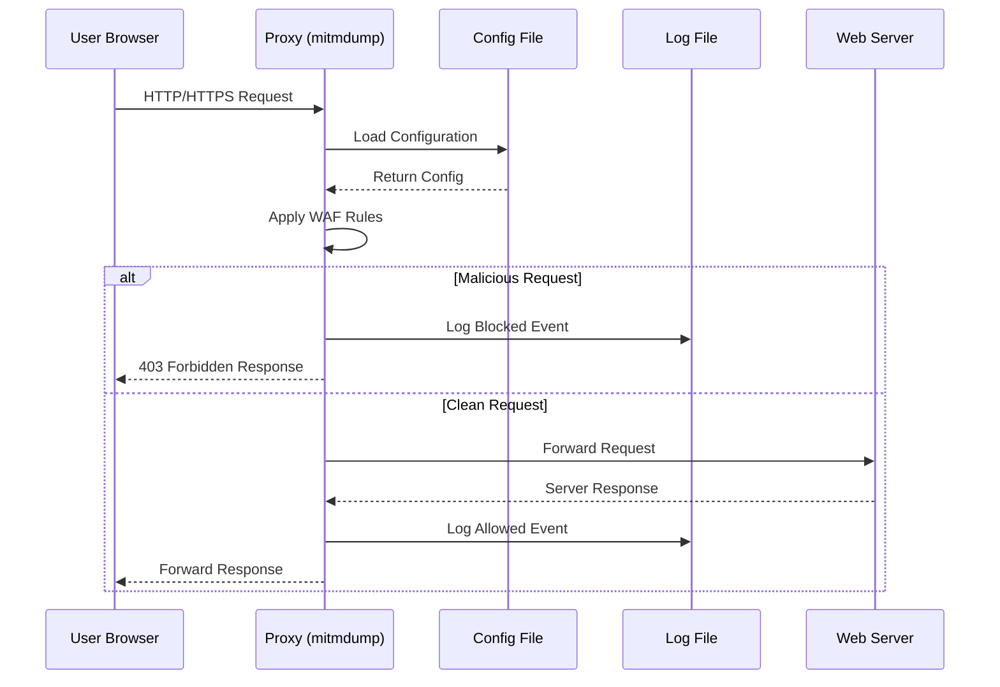
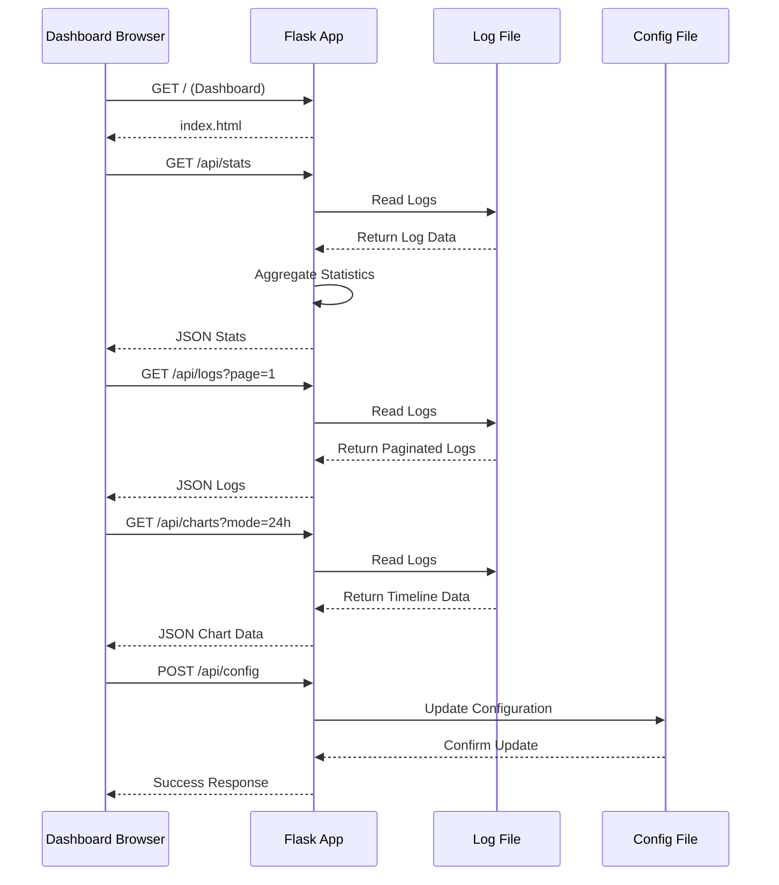
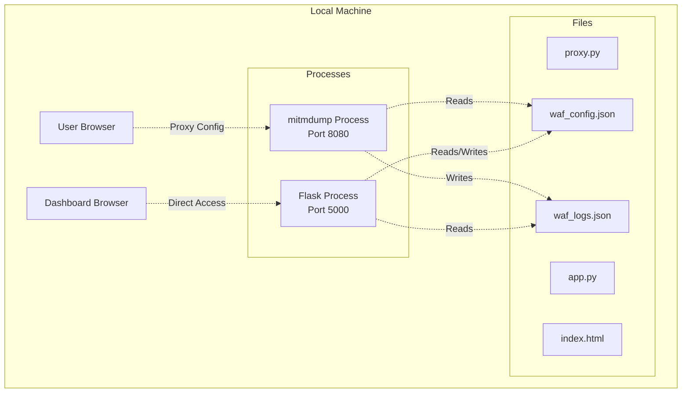

# WAF Security Dashboard - Detailed Architecture and Flow Diagrams

## System Overview

The WAF Security Dashboard is a comprehensive web application firewall system that provides real-time protection against common web attacks while offering a monitoring dashboard. The system consists of two main components:

1. **Proxy Component** (`proxy.py`) - Core WAF engine using mitmproxy
2. **Dashboard Component** (`dashboard/app.py`) - Web-based monitoring interface using Flask

## High-Level Architecture

```mermaid
graph TB
    subgraph "User Environment"
        UB[User Browser<br/>Proxy: 127.0.0.1:8080]
        DB[Dashboard Browser<br/>http://127.0.0.1:5000]
    end

    subgraph "WAF System"
        P[Proxy Server<br/>mitmdump + proxy.py<br/>Port: 8080]

        subgraph "Dashboard System"
            FA[Flask App<br/>app.py<br/>Port: 5000]
            SF[Static Files<br/>index.html, CSS, JS]
        end
    end

    subgraph "Data Layer"
        LF[Log File<br/>waf_logs.json]
        CF[Config File<br/>waf_config.json]
    end

    subgraph "External"
        WS[Web Servers<br/>(Target Applications)]
    end

    UB -->|HTTP/HTTPS Requests| P
    P -->|Filtered Requests| WS
    WS -->|Responses| P
    P -->|Responses| UB

    DB -->|Dashboard Access| FA
    FA -->|Serves UI| SF
    FA -->|Reads/Writes| LF
    FA -->|Reads/Writes| CF
    P -->|Logs Events| LF
    P -->|Reads| CF
```

## Component Details

### 1. Proxy Component (proxy.py)

**Purpose**: Acts as a man-in-the-middle proxy that intercepts, analyzes, and filters HTTP/HTTPS traffic.

**Key Features**:
- SQL Injection Detection
- XSS Attack Prevention
- Rate Limiting
- Brute Force Protection
- IP Blocking
- Real-time Logging

**Core Logic Flow**:



### 2. Dashboard Component (dashboard/app.py)

**Purpose**: Provides a web-based interface for monitoring WAF activity, viewing logs, and managing configuration.

**Key Features**:
- Real-time Statistics Dashboard
- Log Viewer with Pagination
- Threat Analytics and Charts
- Configuration Management
- Log Export (JSON/CSV)

**API Endpoints**:

| Endpoint | Method | Purpose |
|----------|--------|---------|
| `/` | GET | Serves dashboard HTML |
| `/api/logs` | GET | Returns paginated logs |
| `/api/stats` | GET | Returns aggregated statistics |
| `/api/threats` | GET | Returns threat map by IP |
| `/api/charts` | GET | Returns chart data (24h/7d/today) |
| `/api/config` | GET/POST | Get/Update WAF configuration |
| `/export/json` | GET | Export logs as JSON |
| `/export/csv` | GET | Export logs as CSV |

## Data Flow Diagrams

### Request Processing Flow



### Dashboard Data Flow



## Configuration Management

### WAF Configuration Schema

```json
{
  "enable_sqli": true,        // Enable SQL Injection protection
  "enable_xss": true,         // Enable XSS attack protection
  "enable_rate_limit": true,  // Enable rate limiting
  "enable_bruteforce": true   // Enable brute force protection
}
```

### Protection Mechanisms Details

#### SQL Injection Detection
- **Patterns**: Union select, insert into, drop table, OR 1=1, etc.
- **Scoring**: +3 points per pattern match
- **Threshold**: 5 points for blocking
- **Action**: 403 Forbidden with "SQL injection blocked"

#### XSS Attack Prevention
- **Patterns**: `<script>`, `javascript:`, event handlers, etc.
- **Scoring**: +3 points per pattern match
- **Threshold**: 5 points for blocking
- **Action**: 403 Forbidden with "XSS attack blocked"

#### Rate Limiting
- **Limit**: 50 requests per 10 seconds
- **Scope**: Non-static endpoints (GET/POST)
- **Action**: IP block for 120 seconds
- **Response**: 403 Forbidden with "Rate limit exceeded"

#### Brute Force Protection
- **Limit**: 5 attempts per 30 seconds
- **Endpoints**: login, signin, auth, userinfo.php
- **Action**: IP block for 120 seconds
- **Response**: 403 Forbidden with "Brute force detected"

## Log Format

Each log entry is stored as a JSON line in `waf_logs.json`:

```json
{
  "time": "2024-01-20T15:30:45.123456",
  "ip": "192.168.1.100",
  "method": "POST",
  "url": "http://example.com/login.php",
  "attack": "SQLi|None|XSS|BruteForce|RateLimit",
  "action": "BLOCKED|ALLOWED",
  "payload": "username=admin&password=1' OR '1'='1"
}
```

## Deployment Architecture

### Single Machine Deployment



### Startup Sequence

1. **Configuration Check**: Load or create `waf_config.json`
2. **Proxy Start**: Launch `mitmdump -s proxy.py` (Port 8080)
3. **Dashboard Start**: Launch `python dashboard/app.py` (Port 5000)
4. **Browser Setup**: Configure browser proxy to 127.0.0.1:8080
5. **Access Dashboard**: Open http://127.0.0.1:5000

## Security Considerations

### Trusted IPs
- 127.0.0.1 and ::1 are always allowed
- No WAF processing for trusted sources

### Whitelisted Domains
- CDN domains (unpkg.com, cdnjs.cloudflare.com, etc.)
- Font services (fonts.googleapis.com, fonts.gstatic.com)
- Local development (127.0.0.1, localhost)

### IP Blocking Mechanism
- Temporary blocks (120 seconds default)
- Automatic cleanup of expired blocks
- Separate tracking for rate limit and brute force

## Monitoring and Analytics

### Real-time Statistics
- Total requests processed
- Blocked vs allowed ratio
- Attack type distribution
- Threat IP mapping

### Chart Data
- Hourly activity timeline
- Daily/weekly trends
- Attack pattern analysis

### Export Capabilities
- Full log export (JSON/CSV)
- Filtered data export
- Audit trail generation

## Performance Characteristics

### Throughput
- Designed for development/testing environments
- Rate limit: 50 req/10s per IP
- Log retention: Last 10,000 entries

### Resource Usage
- Lightweight Python implementation
- Minimal memory footprint
- File-based storage (no database required)

### Scalability Limitations
- Single-threaded proxy processing
- File-based logging (not suitable for high-volume production)
- No distributed deployment support

## Future Enhancements

### Potential Improvements
- Database integration for logs
- Distributed proxy deployment
- Machine learning-based anomaly detection
- Integration with SIEM systems
- REST API for external integrations
- Docker containerization
- Advanced rule engine
- Custom pattern definitions
- Geo-IP blocking
- User authentication for dashboard

---

*This document provides a comprehensive overview of the WAF Security Dashboard architecture. The system is designed for development and testing environments to provide immediate protection against common web attacks while offering detailed monitoring capabilities.*
