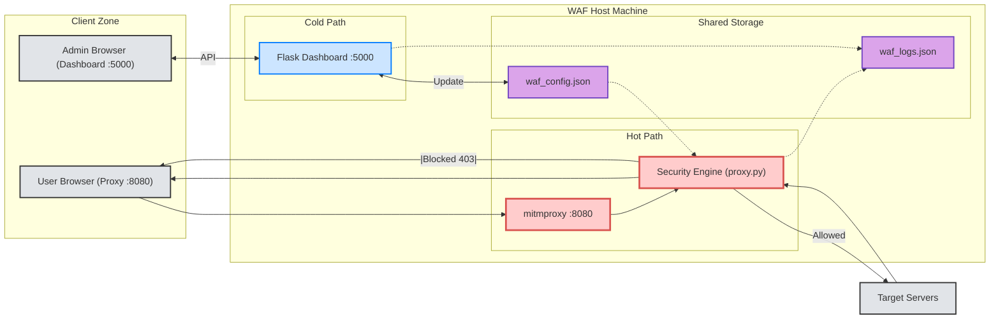
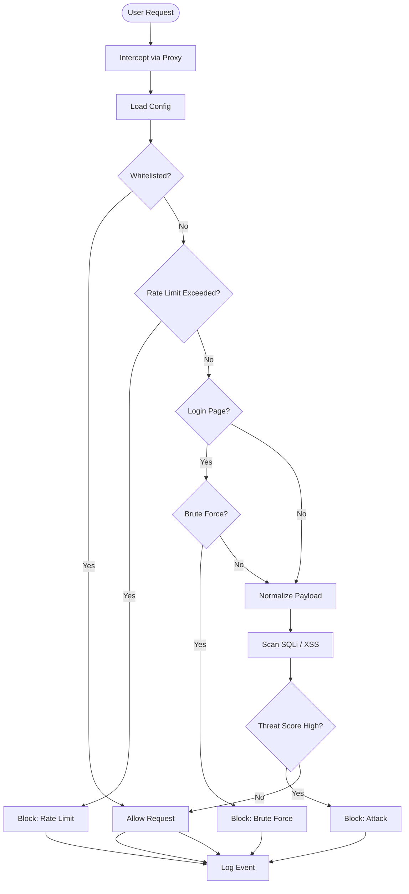
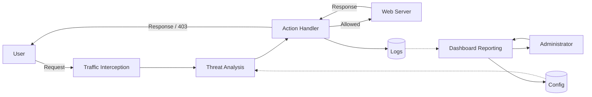

# WAF Project: System Design and Logic Documentation

This document details the visual architecture, decision logic, and data flow of the Web Application Firewall.

---

## 1. System Architecture

The architecture separates the high-speed traffic interception ("Hot Path") from the administrative dashboard ("Cold Path"), using shared JSON files as the synchronization layer.

### Architecture Diagram
*Illustrates the physical components and separation of Client, Host, and Internet zones.*

---

## 2. Process Flow (Algorithm)

This flowchart shows the decision logic applied to every intercepted request.

### Logic Flowchart

---

## 3. Data Flow Diagram (DFD – Level 1)

This diagram shows how data moves between users, processes, and storage.

### DFD Level 1

